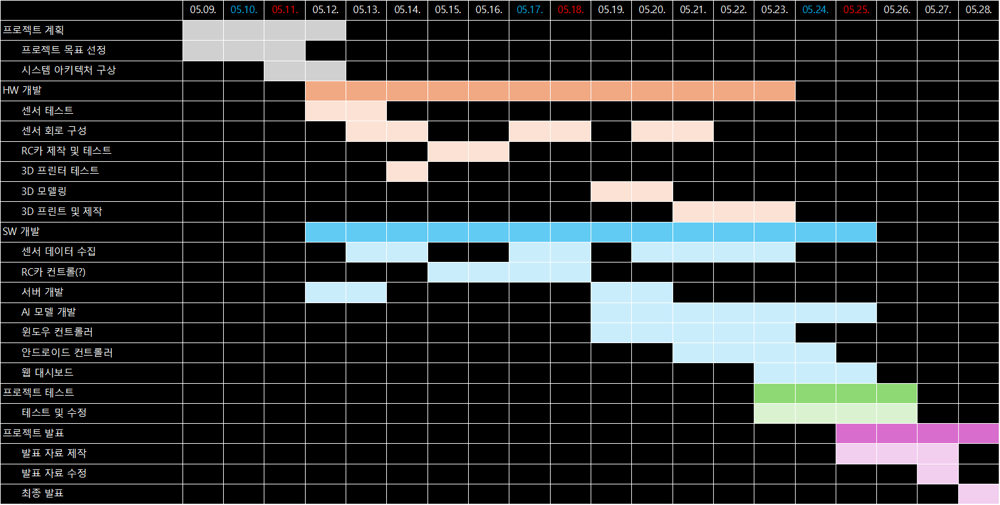
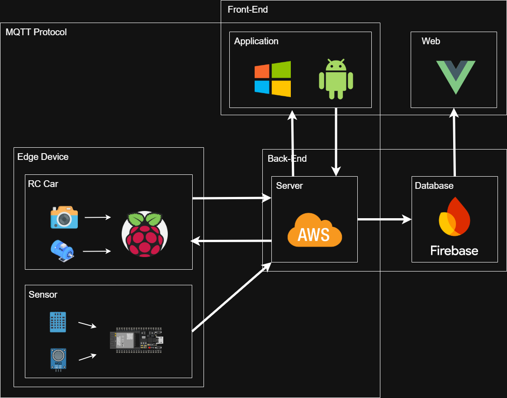

# 🔥 Exprover

IoT 기반의 탐사 로봇으로, 위험 지역을 탐사하기 위해 만들어진 로봇입니다.  
다양한 디바이스(스마트폰, 컴퓨터 등)를 사용하여 원격 조종이 가능하며, 센서를 통해 수집된 데이터를 실시간으로 웹 기반 대시보드를 통해 확인할 수 있습니다.  

## 📅 프로젝트 일정

- 2025.05.09. ~ 2025.05.28.

## 🛠️ 기술 스택

### System Architecture

### 🤖 IoT Device

#### 보드 / 센서

#### 개발 환경

#### 언어 / 라이브러리

### 📱 Android Control App

#### 개발 환경

#### 언어 / 프레임워크

### 💻 Windows Control App

#### 개발 환경

#### 언어 / 라이브러리 / API

### 🌐 Web Dashboard

#### 개발 환경

#### 프레임워크 / 데이터베이스

### ☁️ 서버 / 인프라

### 📦 주요 라이브러리

### 🧩 기타 도구

